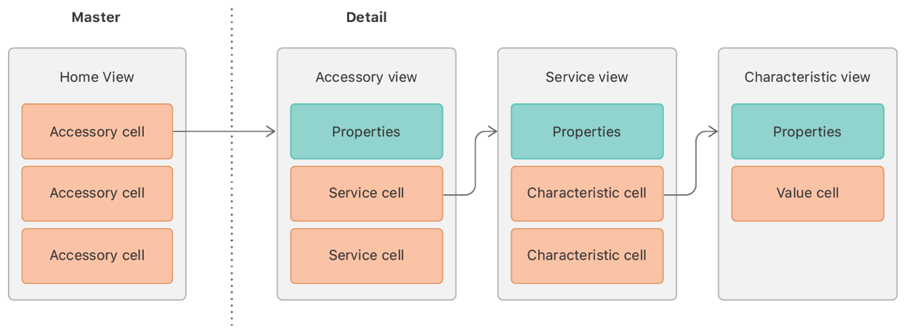

# Interacting with a Home Automation Network

Find all the automation accessories in the primary home and control their state.

## Overview

This sample app introduces you to the accessories, services, and characteristics found in a home automation network, represented by instances of [`HMAccessory`](https://developer.apple.com/documentation/homekit/hmaccessory), [`HMService`](https://developer.apple.com/documentation/homekit/hmservice), and [`HMCharacteristic`](https://developer.apple.com/documentation/homekit/hmcharacteristic), respectively. The sample displays all the properties and relationships it finds using a simple set of hierarchical views inside a split view controller.



This view hierarchy is useful for learning how HomeKit structures device data, which is slightly different than the way the Apple Home app refers to related concepts. It’s also useful for device developers who want to understand how HomeKit sees custom hardware.

In a real app that you publish on the App Store, you would provide a user experience more like the one found in [Configuring a Home Automation Device](https://developer.apple.com/documentation/homekit/configuring_a_home_automation_device). For example, you would focus on the actions a user can take and hide the underlying technical details. For more tips about presenting HomeKit data to users, see the “Adjust the Interface for a Published App” section at the end of this article.

## Configure the Sample Code Project

To be able to use HomeKit, you enable the HomeKit capability and include the [`NSHomeKitUsageDescription`](https://developer.apple.com/documentation/bundleresources/information_property_list/nshomekitusagedescription) key in your app’s `Info.plist` file, as described in [Enabling HomeKit in Your App](https://developer.apple.com/documentation/homekit/enabling_homekit_in_your_app). In this sample app, the capability is already enabled and a usage description is provided.

To be able to build an app that has the HomeKit capability, you must set a valid signing team in the target’s General pane before you build, so that Xcode can create a provisioning profile containing the HomeKit entitlement.

The sample app works with both real devices and simulated ones. If you don’t have any real home automation accessories, or if you want to try an accessory type that you don’t have, use the HomeKit Accessory Simulator (HAS), as described in [Testing Your App with the HomeKit Accessory Simulator](https://developer.apple.com/documentation/homekit/testing_your_app_with_the_homekit_accessory_simulator). You can use a mix of simulated devices and real ones.

## Group Accessories by Room

You always use an instance of [`HMHomeManager`](https://developer.apple.com/documentation/homekit/hmhomemanager) as the root HomeKit object, following the pattern described in [Configuring a Home Automation Device](https://developer.apple.com/documentation/homekit/configuring_a_home_automation_device). As in that sample, this app finds the primary home, allowing the user to create a new one if none exists. In other respects, this sample leaves home management to the Home app.

When HomeKit data finishes loading after initialization, or after the user creates a new home, your home manager delegate—an adopter of the [`HMHomeManagerDelegate`](https://developer.apple.com/documentation/homekit/hmhomemanagerdelegate) protocol—gets access to the user’s homes. Use the delegate to set the home view’s `home` property based on this information. From the corresponding `didSet` observer, you then call the [`resetDisplay(for:)`](x-source-tag://resetDisplay) method to retrieve data from HomeKit and redraw the display, which consists of a list of accessories in the home:

``` swift
func resetDisplay(for home: HMHome?) {
    reloadDisplayData(for: home)
    accessoryView?.accessory = nil
    tableView.reloadData()
}
```

Before triggering a table view reload, use the [`reloadDisplayData(for:)`](x-source-tag://reloadDisplayData) method to prepare a list of accessories sorted by room that can serve as a data source for the home view’s table view. Start with the home’s default room—accessible using the [`roomForEntireHome()`](https://developer.apple.com/documentation/homekit/hmhome/1620227-roomforentirehome) method. Add that to the contents of the home’s [`rooms`](https://developer.apple.com/documentation/homekit/hmhome/1620276-rooms) array. Then filter out any rooms from this composite group lacking accessories. Sort the remaining rooms by name:

``` swift
rooms = ([home.roomForEntireHome()] + home.rooms)
    .filter { !$0.accessories.isEmpty }
    .sorted { $0.name < $1.name }
```

## Group Accessories by Category

Alternatively, you can display accessories sorted by category. Accessories have a [`category`](https://developer.apple.com/documentation/homekit/hmaccessory/1615275-category) property, which is an instance of the [`HMAccessoryCategory`](https://developer.apple.com/documentation/homekit/hmaccessorycategory) class that indicates what the device is, like a door or a light. You can derive a name from this information, and use that to group accessories:

``` swift
home.accessories.forEach {
    let name = $0.displayName   // Computed from the accessory's category.
    if let index = categories.firstIndex(where: { $0.name == name }) {
        categories[index].accessories.append($0)
    } else {
        categories.append(Category(name: name, accessories: [$0]))
    }
}
```

Unlike the [`HMRoom`](https://developer.apple.com/documentation/homekit/hmroom) class, the [`HMAccessoryCategory`](https://developer.apple.com/documentation/homekit/hmaccessorycategory) class doesn’t natively contain the list of related accessories. So you define a local [`Category`](x-source-tag://Category) type to serve as a category container:

``` swift
struct Category: AccessoryGroup {
    var name: String
    var accessories: [HMAccessory]
}
```

As indicated in the previous and next snippet, both the [`Category`](x-source-tag://Category) type and the [`HMRoom`](https://developer.apple.com/documentation/homekit/hmroom) type adopt the [`AccessoryGroup`](x-source-tag://AccessoryGroup) protocol, which declares both a name and a list of accessories. This ensures that either type can serve as the data source:

``` swift
protocol AccessoryGroup {
    var name: String { get }
    var accessories: [HMAccessory] { get }
}

// Assert that HMRoom already adopts the AccessoryGroup protocol.
extension HMRoom: AccessoryGroup {}
```

## Pick a Grouping to Display

To enable the user to select between displaying accessories grouped by room or category, use a segmented controller in the home view’s toolbar to set the `groupKey` property:
 
``` swift
@objc
func changeSeg(_ sender: UISegmentedControl) {
    groupKey = sender.selectedSegmentIndex == 0 ? .room : .category
}
```

Inside the `groupKey` property’s `didSet` observer, reload the table view without reloading data from HomeKit:

``` swift
var groupKey = GroupKey.room {
    didSet {
        // Refreshes the view without reloading the display data from HomeKit.
        accessoryView?.accessory = nil
        tableView.reloadData()
    }
}
```

You use the table view's data source and delegate methods to prepare table cells based on the current grouping of accessories, as specified by the `groupKey` property.

## Add New Accessories

To enable the pairing of new accessories, the UI presents a `+` button in the home view that the user taps to initiate a search for accessories on the local network. The button’s tap handler calls the home’s [`addAndSetupAccessories(completionHandler:)`](https://developer.apple.com/documentation/homekit/hmhome/1771427-addandsetupaccessories) method, which presents the standard HomeKit UI for locating and adding new accessories to a given home:

``` swift
home?.addAndSetupAccessories { error in
    if let error = error {
        print(error)
    } else {
        // Make no assumption about changes; just reload everything.
        self.resetDisplay(for: self.home)
    }
}
```

On success, the completion handler refreshes the app’s copy of the HomeKit data and redraws the display.

## Show Accessory, Service, and Characteristic Details

The sample app’s split view detail controller shows an [`AccessoryView`](x-source-tag://AccessoryView) with information about a single accessory. This includes a list of accessory properties, like the accessory’s name and manufacturer. It also includes services, like a door opener or a light bulb, that the accessory offers. Optionally, for an accessory that’s a bridge, which is an accessory that serves as a link to accessories on a non-HomeKit network, the view also shows a list of the accessories to which the bridge provides access.

- Note: Bridged accessories (those with the [`isBridged`](https://developer.apple.com/documentation/homekit/hmaccessory/1615251-isbridged) property set to `true`) also appear in the home view’s main list of accessories because HomeKit makes them directly accessible. Listing them in the accessory view is a convenience to show the relationship with their bridge.

When the user taps an accessory in the home view, you use the [`prepare(for:sender:)`](https://developer.apple.com/documentation/uikit/uiviewcontroller/1621490-prepare) method override to assign the corresponding accessory to the accessory view, which triggers the view to reload its content:

``` swift
let accessory = grouping[indexPath.section].accessories[indexPath.row]
controller.accessory = accessory
```

When the user taps a service in the accessory view, you push a [`ServiceView`](x-source-tag://ServiceView) instance on the navigation stack. The service view lists the corresponding service’s properties, like its name. It also lists the associated characteristics, which are the control points and data values that the service exposes. For example, the garage door opener service might have a characteristic whose value you set to indicate whether the garage door should be opened or closed. It might have another characteristic whose value you read to find out where the garage door is right now—open, closed, or something in between. 

When the user taps a characteristic in the service view, you push a [`CharacteristicView`](x-source-tag://CharacteristicView) instance onto the navigation stack to provide details about that specific characteristic, like its name and the content of its associated value.

## Read Characteristic Values Before Using Them

A characteristic is primarily a container for its [`value`](https://developer.apple.com/documentation/homekit/hmcharacteristic/1624195-value) property that represents an input to or output from a service. Other properties of the characteristic tell you about that value, like if it’s a Boolean, number, string, or something else, what units apply to it, whether you can read or write it, and so on.

When the user taps a service in the accessory view, the incoming service view writes a characteristic to each of its characteristic cells. This begins the process of populating the cell’s UI, for example by adjusting the visibility of the cell’s controls depending on the characteristic value’s type. But the cell can’t rely on the actual value until it calls the characteristic’s [`readValue(completionHandler:)`](https://developer.apple.com/documentation/homekit/hmcharacteristic/1624188-readvalue) method.

``` swift
characteristic.readValue { error in
    if let error = error {
        print(error.localizedDescription)
    } else {
        self.redrawValueLabel()
        self.redrawControls(animated: animated)
    }
}
```

You can access the [`value`](https://developer.apple.com/documentation/homekit/hmcharacteristic/1624195-value) property at any time, but this is a cached value from the last interaction with the physical accessory, if any. Performing an explicit read operation prompts HomeKit to ask the accessory for the characteristic’s current value, and update its local copy. Because this query involves network access, HomeKit reports the value to your app in a completion handler, which then finalizes the UI changes by setting the cell’s label text and the control state.

The characteristic view, which also displays the characteristic value, doesn’t perform an explicit read. The user can only get to the characteristic view by tapping on a service view’s characteristic cell, which has recently refreshed the corresponding value. Both views rely on accessory delegate callbacks to track any further changes in the value, as described in the next section.

## Keep Home Data Up To Date

HomeKit gives apps access to a shared home automation network. Apps other than yours, including the Home app, can change service names, characteristic values, the layout of a home, and other attributes. Accessories can also drive changes independently. For example, a garage door opener might have an obstruction sensor with output that varies based on physical changes in the environment. To keep your app’s local data caches and user interfaces up to date with outside changes, your app adopts HomeKit delegate protocols.

The sample app’s home view adopts the  [`HMHomeManagerDelegate`](https://developer.apple.com/documentation/homekit/hmhomemanagerdelegate) protocol to handle changes in the list of homes, as described in the section “Create a Home Manager and Get the Primary Home”. This particular implementation ensures that the home view always shows the primary home.

The home view also implements the  [`HMHomeDelegate`](https://developer.apple.com/documentation/homekit/hmhomedelegate) protocol to be informed of changes within the chosen home. Because these kinds of changes affect the entire user interface, the app redraws the whole display when anything changes, such as when a room is added by another app:

``` swift
func home(_ home: HMHome, didAdd room: HMRoom) {
    guard home == self.home else { return }
    resetDisplay(for: home)
}
```

## Keep Accessory Data Up To Date

Accessory changes, reported by the  [`HMAccessoryDelegate`](https://developer.apple.com/documentation/homekit/hmaccessorydelegate) protocol, typically don’t warrant completely redrawing the entire interface, but can nonetheless affect multiple view controllers. However, an accessory can have only a single delegate.

For example, it would be disruptive to reset the entire user interface to show only that a light bulb is turned off. But the corresponding characteristic value affects both a toggle switch in a characteristic cell and a value label in the related characteristic view. Both of these might be on the detail view’s navigation stack at the same time and need to be informed of the change.

To solve this, the home store singleton acts as the accessory delegate for all accessories, set whenever the home is updated: 

``` swift
home?.accessories.forEach { $0.delegate = HomeStore.shared }
```

The home store also becomes the accessory delegate for any accessories added later, set in the [`home(_:didAdd:)`](https://developer.apple.com/documentation/homekit/hmhomedelegate/1620215-home) delegate method:

``` swift
func home(_ home: HMHome, didAdd accessory: HMAccessory) {
    guard home == self.home else { return }
    resetDisplay(for: home)
    
    // Make sure the new accessory generates callbacks to the home store.
    accessory.delegate = HomeStore.shared
}
```

The home store can then act as an accessory delegate hub. Any view controllers that want to receive accessory delegate callbacks register themselves by calling the [`addAccessoryDelegate(:)`](x-source-tag://addAccessoryDelegate) method:

``` swift
func addAccessoryDelegate(_ delegate: NSObject) {
    accessoryDelegates.insert(delegate)
}
```

When the home store receives a delegate callback, it passes the call along to all interested parties, such as when a characteristic value changes:

``` swift
func accessory(_ accessory: HMAccessory, service: HMService, didUpdateValueFor characteristic: HMCharacteristic) {
    accessoryDelegates.forEach {
        guard let delegate = $0 as? HMAccessoryDelegate else { return }
        delegate.accessory?(accessory, service: service, didUpdateValueFor: characteristic)
    }
}
```

## Register for Characteristic Value Update Notifications

Most delegate callbacks work by default. However, your app only receives callbacks for characteristic value changes—the delegate method shown at the end of the previous section—when it explicitly enables them. The sample app does this by calling the service’s [`enableNotifications`](x-source-tag://enableNotifications) method whenever the service view’s `service` property changes.

``` swift
var service: HMService? {
    willSet {
        // Disable notifications on the previous service characteristics.
        service?.enableNotifications(false)
    }
    didSet {
        // Enable notifications on the new service characteristics.
        service?.enableNotifications(true)
        reloadDisplayData()
    }
}
```

This method—defined in an [`HMService`](https://developer.apple.com/documentation/homekit/hmservice) extension—in turn calls the  [`enableNotification(_:completionHandler:)`](https://developer.apple.com/documentation/homekit/hmcharacteristic/1624189-enablenotification) method of all the characteristics within the given service that have the [`HMCharacteristicPropertySupportsEventNotification`](https://developer.apple.com/documentation/homekit/hmcharacteristicpropertysupportsevent) property.

``` swift
func enableNotifications(_ enabled: Bool) {
    for characteristic in characteristics
        where characteristic.properties.contains(HMCharacteristicPropertySupportsEventNotification) {
        
        characteristic.enableNotification(enabled) { error in
            if let error = error {
                print(error.localizedDescription)
            }
        }
    }
}
```

The sample app also deactivates notifications for characteristics that are no longer needed. The `willSet` property observer, as shown in the code above, calls the same enabling method, but with `false` as the input, for the service property value as it exists before the update.

## Adjust the Interface for a Published App

For a HomeKit app that you want to publish in the App Store, you design a different user interface than the one in this sample app.

__Expose a lot less detail about individual accessories, services, and characteristics.__ Only present information that’s really useful. Most users aren’t interested in unique device identifiers and firmware versions. At a minimum, nest or deemphasize less important details.

__Focus on services as the root interface element, just like in the Home app.__ Help users complete tasks by focusing on the actions they can perform, or the data they can read, rather than the physical objects in the environment.

__Expose only user interactive services.__ Hide services not reported as user interactive by the device.

__Feature behaviors and settings specific to your app.__ If your app supports devices only from a certain manufacturer, or with certain capabilities, filter out the accessories that don’t match. Reduce clutter and present only those devices or capabilities that make sense for your app.

__Provide meaningful interfaces for custom elements.__ Your app might enable users to manage custom services and characteristics of a device that you develop. For example, a light service might offer a power-down decay rate characteristic, reducing brightness from full on to full off over a configurable period of time. The Home app doesn’t expose this characteristic, but your app can provide the user with a suitable interface to control it.

For more information about user interface considerations for HomeKit enabled apps, see the [HomeKit](https://developer.apple.com/design/human-interface-guidelines/homekit/overview/introduction/) section of the [Human Interface Guidelines](https://developer.apple.com/design/human-interface-guidelines/).  

